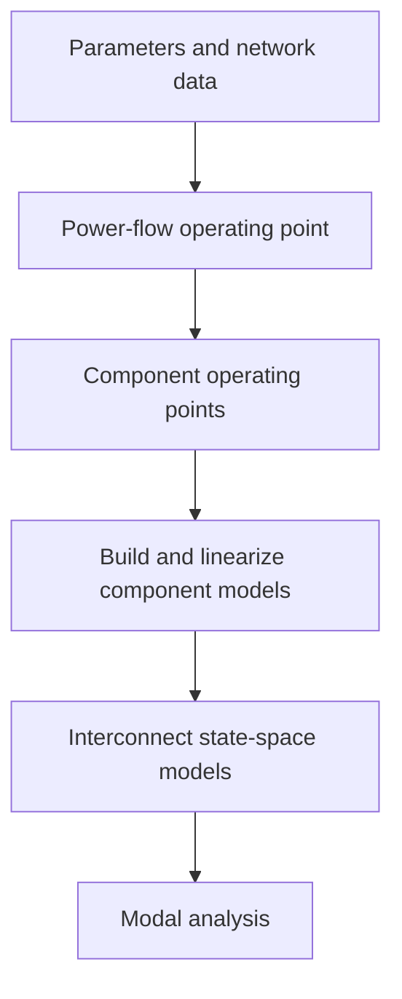

# Modular System State-Space

This project provides a modular MATLAB workflow for small-signal state-space
modeling and analysis of electrical power systems. System data and network
connectivity are used to calculate operating points, assemble component
models, and study the resulting interconnected system.

The root-level `main.m` is used as the project benchmark. Separate study
configurations are kept under `case_studies/` and can be extended as new cases
are added. The current case-study folder is `Case_1` (OWPP + Onshore STATCOM).

The project requires MATLAB, MATPOWER, Symbolic Math Toolbox, and Control
System Toolbox. MATPOWER must be installed separately and available on the
MATLAB path.
