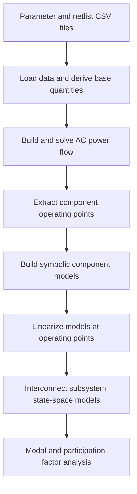

# Modular System State-Space

This project provides a modular MATLAB workflow for building and analyzing small-signal state-space models of electrical power systems. It combines parameter and network data, a power-flow operating point, component models, and system-level interconnection before performing modal analysis.

The workflow uses a mixed-base approach: the network power flow is solved on a single system base, while dynamic component models are evaluated using local base quantities derived from the parameter set.

## Requirements

- MATLAB
- [MATPOWER](https://matpower.org/) installed separately and available on the MATLAB path
- Symbolic Math Toolbox
- Control System Toolbox
- Optimization Toolbox for the standalone `power_flow_DC.m` example (`fsolve`)

The repository does not currently enforce a minimum MATLAB or MATPOWER version. The implementation uses symbolic Jacobians, `ss` models, `connect`, `sumblk`, and `uifigure`.

## Repository Structure

```text
.
|-- main.m                         State-space benchmark workflow
|-- power_flow_DC.m                Standalone DC/AC power-flow example
|-- data/
|   |-- parameters.csv             System, converter, line, and grid parameters
|   `-- netlist.csv                Component connectivity and operating modes
|-- lib/
|   |-- Setup/
|   |   |-- loadParameters.m       Loads CSV data and derives base quantities
|   |   |-- DC_Cap.m               Calculates DC-link capacitance and voltage
|   |   `-- thevenin.m              Calculates the grid Thevenin equivalent
|   |-- PowerFlow/
|   |   |-- loadNetlist.m           Reads the connectivity table
|   |   |-- powerflow.m             Builds and solves the MATPOWER case
|   |   |-- PF_results.m            Extracts operating-point values
|   |   |-- OP_Converters.m         Converts converter operating points to pu
|   |   |-- OP_Line.m               Converts line operating points to pu
|   |   |-- OP_Grids.m              Converts grid operating points to pu
|   |   `-- OP_RL.m                 Converts RL branch operating points to pu
|   `-- State_Space/
|       |-- stability_analysis.m    Eigenvalue and participation-factor analysis
|       `-- Classes/
|           |-- Converter_GFL.m      Grid-following converter model
|           |-- Line.m               PI-section line model
|           |-- Grid.m               Grid Thevenin RL model
|           `-- RL.m                 Series RL branch model
|-- case_studies/                    Separate case-study inputs and workflow
|-- DESCRIPTION.md                  Short project description
`-- LICENSE                         MIT license
```

## Input Data

The model is configured through two CSV files in [`data/`](data/):

- [`parameters.csv`](data/parameters.csv) contains base quantities, setpoints, electrical parameters, controller gains, and grid strength data.
- [`netlist.csv`](data/netlist.csv) defines component IDs, component parameters, and the `From`/`To` bus connections. A connection to bus `0` represents a shunt-connected source or element.

The files in `data/` provide the input configuration for the root-level benchmark. Each folder under `case_studies/` contains inputs for a separate study. The netlist describes component types, operating modes, and bus connections; parameter values are provided separately. A `PQ` source requires both `P_set` and `Q_set` entries in its parameter file.

## Main Workflow

The execution path in [`main.m`](main.m) consists of the following steps.



### 1. Load parameters and the netlist

`loadParameters` reads the parameter table and creates the `parameters` structure. It also calculates system base quantities such as angular frequency, base impedance, base inductance, and base capacitance.

In addition to the system base, component-local base quantities are derived and stored in the converter, line, and grid structures. These local bases are used by the dynamic models during operating-point conversion and linearization.

`loadNetlist` reads the connectivity table into a MATLAB table.

### 2. Solve the AC power flow

`powerflow(parameters, netlist)` builds a MATPOWER case from the netlist:

- buses are created from the highest non-zero bus number in the netlist;
- `PQ`, `PV`, and `Slack` source entries become MATPOWER bus or generator definitions;
- converter `R_vsc2` entries become series RL branches;
- `RL` entries become series RL branches;
- line `R_line` entries become series RL branches;
- grid `R_grid` entries become the grid Thevenin RL branch;
- line capacitor entries are added as bus shunts, split between the two line terminals.

All electrical quantities are converted to a single system base before the MATPOWER case is solved. MATPOWER returns bus voltages and angles, generator powers, and branch power flows.

### 3. Extract and convert operating points

`PF_results` extracts the operating-point values for each converter, line, and grid from the MATPOWER solution. The `OP_*` functions then map these values from the single power-flow base to the per-unit quantities required by each dynamic component model, including:

- converter currents, filter voltages, controller states, and references;
- line terminal voltages and currents for the PI section;
- grid source voltage, current, and point-of-connection voltage.

These values are used as the equilibrium around which the dynamic equations are linearized.

### 4. Build symbolic component models

Each class exposes a `build()` method. It defines symbolic differential equations, algebraic equations, inputs, outputs, and parameters.

- `Converter_GFL` includes the converter filters, DC-link dynamics, outer active/reactive or voltage control loops, inner current controllers, PLL, and frame transformations.
- `Line` represents a series RL branch with shunt capacitance at both terminals.
- `RL` represents a generic series RL branch.
- `Grid` represents the Thevenin equivalent as a dynamic RL branch.

For the converter, the algebraic equations are eliminated symbolically. The resulting state-space Jacobians are obtained from the differential and algebraic equations.

### 5. Evaluate the linearized models

The `evaluate()` method substitutes the operating point and numerical parameters into the symbolic Jacobians and creates MATLAB `ss` objects. It also calculates differential and algebraic equilibrium residuals, which indicate how closely the supplied operating point satisfies the model equations.

Each model receives unique state names based on its component ID. These names are later used by the system-level interconnection and stability analysis.

### 6. Interconnect the subsystems

The benchmark assigns names to subsystem inputs and outputs, then uses MATLAB `connect()` and summing blocks to form the interconnected model. Signal names and the chosen external inputs and outputs depend on the configured system.

### 7. Perform modal stability analysis

`stability_analysis(SYS)` computes the eigenvalues of the assembled state matrix, damping ratios, modal frequencies, and participation factors. It produces:

- a pole-zero map with the selected critical mode;
- a table of eigenvalues and modal quantities in the MATLAB command window;
- a participation-factor table for the critical mode;
- a GUI table showing the participation factors of all states and modes.

The critical mode is selected as the stable mode with the lowest damping ratio. If no stable modes exist, the first non-stable mode is selected.

## Benchmark and Case Studies

The root-level [`main.m`](main.m) is used as the project benchmark. It uses the shared model-building and analysis workflow with the input files under `data/`.

The [`case_studies/`](case_studies/) folder contains separate study configurations. The current list is:

| Folder | Case |
| --- | --- |
| [`Case_1`](case_studies/Case_1/) | OWPP + Onshore STATCOM |
| [`Case_2`](case_studies/Case_2/) | 2 x OWPP different power size |

Add future studies to this list as folders are added. Each case has its own parameter and netlist files.

## Running the Benchmark

From the repository root, make the library and data folders available on the MATLAB path before calling `main`:

```matlab
addpath(genpath('lib'));
addpath('data');
main
```

MATPOWER must already be installed and available on the MATLAB path. The current `main.m` expects `parameters.csv` and `netlist.csv` to be resolvable from the MATLAB path; adding `data/` as shown above is therefore required unless the files are copied or the MATLAB path is configured differently.

To run a case study, use that case's folder and CSV inputs, and add the repository's `lib/` folder to the MATLAB path as well.

## Standalone DC Power-Flow Example

[`power_flow_DC.m`](power_flow_DC.m) is separate from the main modular state-space workflow. It:

1. solves an AC power flow for the first AC area;
2. solves a three-node DC network with `fsolve`;
3. uses the resulting DC powers to define two additional AC power-flow cases;
4. stores the resulting AC and DC operating points in the `iniz` structure.

It is an exploratory example and is not called by [`main.m`](main.m).

## License

This project is distributed under the MIT License. See [`LICENSE`](LICENSE).
